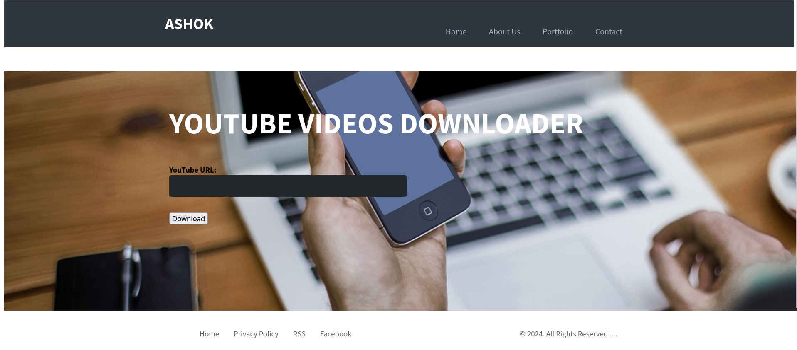

# YouTube Video Downloader


A simple Flask-based YouTube video downloader that allows users to download videos and audio in various formats using \`yt-dlp\`. 

## Features

- Select video and audio formats separately.
- Download video only, audio only, or both.
- Real-time progress updates.
- Easy to deploy on cloud services like Koyeb.

## Screenshots

### Home Page


## How to Use

### Prerequisites

- Python 3.9+
- yt-dlp
- Flask
- Flask-SocketIO (for real-time updates)

### Installation

1. **Clone the Repository**

    ```bash
    git clone https://github.com/Ashok-Prajapati2/youtube-downloader
    cd youtube-downloader
    python3 -m venv venv
    source venv/bin/activate
    ```

2. **Install Dependencies**

    You can install the required Python packages using \`pip\`:

    
    pip install -r requirements.txt
    

### Running the Application

1. **Run the Flask Application**

    Use the \`run.py\` file to start the Flask development server:

    
    python3 run.py
    

2. **Access the Application**

    Open your web browser and go to \`http://127.0.0.1:5000/\`.

3. **Download a Video**

    - Enter the YouTube URL.
    - Select the video and audio formats.
    - Click the "Download" button.
    - Wait for the download to complete, and the file will be saved in the specified output directory.

## Deployment

This project deployed on platforms  Koyeb.


### Deployment on Koyeb

1. **Web Page**

    Follow Koyeb's documentation to push the code to their platform.
      
    sore-desiree-student098-ee31c4ca.koyeb.app/
    

2. **Set Up Environment Variables**

    - \`FLASK_APP\`: Set to \`run.py\`.
    - \`YT_DLP_OPTIONS\`: Set any options you need for \`yt-dlp\`.

## License

This project is licensed under the MIT License. See the \`LICENSE\` file for more details.

## Contributing

Contributions are welcome! Please open an issue or submit a pull request.

